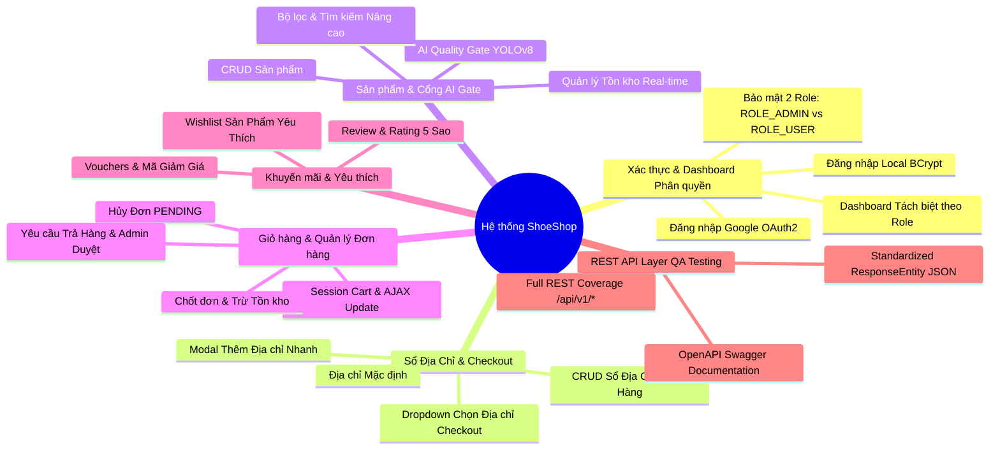
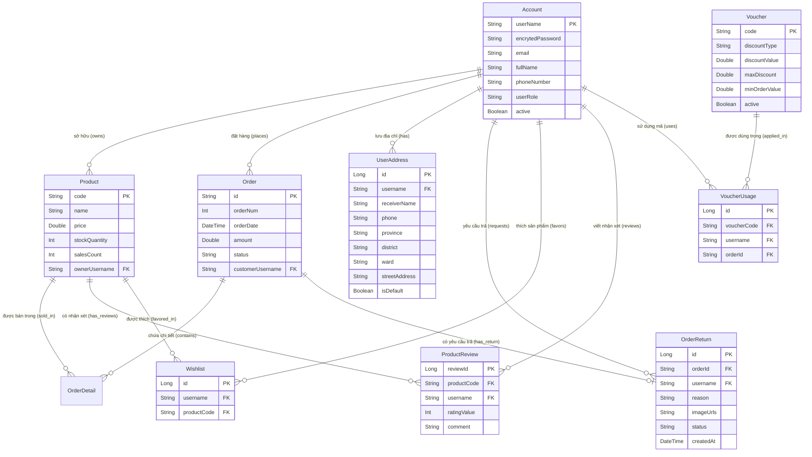

<p align="center">
  
</p>

<h1 align="center">👟 ShoeShop - Tài liệu SRS & Hướng dẫn Vận hành Systems</h1>

<p align="center">
  <strong>Nền tảng thương mại điện tử giày dép tích hợp AI Kiểm duyệt chất lượng ảnh, Quản lý Sổ địa chỉ, Hủy/Trả hàng & Lớp REST API cho QA Testing</strong>
</p>

<p align="center">
  
  
  
  
  
</p>

---

## 🎯 1. Mục tiêu hệ thống (System Goals)

**ShoeShop** là một hệ thống thương mại điện tử đa nền tảng hiện đại, được xây dựng trên kiến trúc lai (Hybrid Architecture) kết hợp giữa **Server-Side Rendering (Thymeleaf)** cho trải nghiệm người dùng Web mượt mà và lớp **RESTful API song song (`/api/v1/`)** dành riêng cho kiểm thử tự động (QA Testing/Postman) và tích hợp ứng dụng di động. Hệ thống tích hợp sẵn Microservice AI (Python FastAPI + YOLOv8) để kiểm duyệt chất lượng hình ảnh sản phẩm trước khi lưu vào cơ sở dữ liệu.

### 1.1. Vấn đề thực tiễn
Các sàn thương mại điện tử và cửa hàng bán lẻ giày dép thường gặp phải các thách thức vận hành:
- **Kiểm duyệt ảnh thủ công tốn chi phí:** Người bán đăng ảnh kém chất lượng, ảnh nhái, không đúng chuẩn thương hiệu gây tổn hại uy tín sàn.
- **Bán vượt tồn kho (Overselling):** Không kiểm soát tồn kho tức thời (Real-time Stock) dẫn đến việc khách hàng đặt hàng khi sản phẩm đã hết trong kho.
- **Thiếu chức năng Quản lý Địa chỉ & Hủy/Trả hàng:** Khách hàng không thể lưu nhiều địa chỉ nhận hàng hoặc yêu cầu hủy/trả hàng trực tiếp trên hệ thống.
- **Khó khăn trong kiểm thử tự động:** Các ứng dụng Web SSR thuần túy thường trả về giao diện HTML khiến đội ngũ QA khó viết kịch bản test API tự động bằng Postman hay REST Assured.
- **Phân quyền chưa tách biệt:** Cần phân định chính xác ranh giới quyền hạn giữa Khách hàng (`ROLE_USER`) và Chủ shop (`ROLE_ADMIN`).

### 1.2. Giải pháp của ShoeShop
ShoeShop giải quyết triệt để các vấn đề trên thông qua:
- **Cổng AI Kiểm duyệt ảnh tự động (AI Quality Gate):** Tích hợp microservice Python FastAPI chạy mô hình YOLOv8 để tự động phân tích độ phân giải, định dạng và chất lượng hình ảnh sản phẩm được tải lên bởi Người bán/Admin trước khi lưu DB.
- **Hệ thống Quản lý tồn kho tức thời (Stock & Inventory Management):** Tự động trừ tồn kho khi chốt đơn hàng, hoàn tồn kho khi hủy/trả hàng, ngăn chặn hành vi đặt hàng vượt số lượng khả dụng.
- **Phân hệ Sổ địa chỉ nhận hàng (Address Book Management):** Cho phép người dùng lưu, chỉnh sửa, xóa và chọn nhanh địa chỉ mặc định ngay tại trang Checkout.
- **Quy trình Hủy đơn & Yêu cầu Trả hàng (Order Cancellation & Return System):** Cho phép khách hàng hủy đơn hàng ở trạng thái `PENDING` và tạo yêu cầu trả hàng (kèm lý do & hình ảnh minh chứng) để Admin duyệt/từ chối.
- **Phân biệt Dashboard theo Role:** Tách biệt hoàn toàn giao diện `/admin/accountInfo` cho Khách hàng (`ROLE_USER`) và Chủ shop (`ROLE_ADMIN`).
- **Kiến trúc REST API song song (`/api/v1/`):** Cung cấp bộ API RESTful chuẩn mực bọc dữ liệu trong `ResponseEntity<?>` kèm HTTP Status Codes chính xác, hỗ trợ kiểm thử tự động QA và tích hợp ứng dụng di động.

---

## 🛠️ 2. Yêu cầu chức năng (Functional Requirements)

Hệ thống ShoeShop được thiết kế thành các phân hệ chức năng chuyên biệt:



### 2.1. Phân hệ Xác thực & Dashboard Tách biệt theo Role
- **Xác thực Đăng nhập:**
  - Hỗ trợ 2 phương thức: Đăng nhập Local (BCrypt hash) và Đăng nhập Google OAuth2.
  - Phân quyền nghiêm ngặt theo 2 vai trò chuẩn: `ROLE_ADMIN` (Chủ shop) và `ROLE_USER` (Khách hàng).
- **Dashboard Phân biệt theo Role (`/admin/accountInfo`):**
  - **Khách hàng (`ROLE_USER`):** Hiển thị KPI Tổng chi tiêu, Đơn hàng đã đặt, Số sản phẩm yêu thích và Sổ địa chỉ. Cung cấp các thao tác nhanh dành riêng cho khách hàng (Sổ địa chỉ, Lịch sử đơn hàng, Sản phẩm yêu thích, Khám phá cửa hàng). Ẩn hoàn toàn biểu đồ doanh thu và log quản trị.
  - **Chủ shop (`ROLE_ADMIN`):** Hiển thị Biểu đồ Doanh thu (`Revenue Analytics`), Tổng thành viên, Tổng đơn hàng toàn shop, Lịch sử hoạt động hệ thống (`Recent Activity`), Trạng thái AI Service, Quản lý Vouchers và Tồn kho.

### 2.2. Phân hệ Sổ Địa Chỉ Giao Hàng (Address Book Management)
- **Quản lý Địa chỉ Cá nhân:**
  - Khách hàng xem danh sách địa chỉ, thêm địa chỉ mới, cập nhật hoặc xóa địa chỉ nhận hàng qua API `/api/v1/users/addresses`.
  - Cho phép chọn 1 địa chỉ làm **Địa chỉ Mặc định**.
- **Tích hợp Checkout:**
  - Tại trang Thanh toán (`shoppingCartCustomer.html`), tự động hiển thị Dropdown danh sách địa chỉ đã lưu kèm nút "Thêm Địa Chỉ Nhanh" dạng Modal.

### 2.3. Phân hệ Quản lý Sản phẩm & Cổng AI Kiểm duyệt (Product Management & AI Quality Gate)
- **Danh sách & Bộ lọc Sản phẩm (`/productList`):**
  - Phân trang danh sách sản phẩm với các bộ lọc linh hoạt: Theo danh mục, thương hiệu (GEN ALPHA, COOLMATE,...), khoảng giá và sắp xếp.
- **Cổng AI Kiểm duyệt Ảnh (AI Quality Gate):**
  - Tự động chuyển tiếp file ảnh sản phẩm mới tới Python FastAPI Service (`/api/v1/analyze`) chạy YOLOv8 để phân tích chất lượng ảnh trước khi lưu DB.
- **Quản lý Tồn kho (Inventory Management):**
  - Cho phép Admin nhập và cập nhật số lượng tồn kho (`stockQuantity`). Hiển thị nhãn "Hết hàng" khi `stockQuantity <= 0`.

### 2.4. Phân hệ Giỏ hàng, Đơn hàng & Quy trình Hủy/Trả hàng
- **Giỏ hàng & Thanh toán:**
  - Cập nhật số lượng giỏ hàng bằng AJAX, kiểm tra tồn kho thời gian thực.
- **Hủy Đơn Hàng (`POST /api/v1/orders/{orderId}/cancel`):**
  - Khách hàng chính chủ có thể hủy đơn hàng khi đơn ở trạng thái `PENDING`. Hệ thống tự động hoàn lại số lượng tồn kho sản phẩm trong giao dịch `@Transactional`.
- **Yêu cầu Trả Hàng (`POST /api/v1/orders/{orderId}/return`):**
  - Khách hàng có thể gửi yêu cầu trả hàng đối với các đơn đã giao, cung cấp lý do và hình ảnh minh chứng.
- **Admin Duyệt/Từ Chối Trả Hàng (`PUT /api/v1/admin/orders/{orderId}/return-status`):**
  - Admin xem xét yêu cầu trả hàng, thực hiện Duyệt (`APPROVED`) hoặc Từ chối (`REJECTED`). Khi duyệt trả hàng, hệ thống tự động cộng hoàn tồn kho sản phẩm.

### 2.5. Phân hệ Mã Giảm Giá (Vouchers) & Sản Phẩm Yêu Thích (Wishlist)
- **Mã Giảm Giá (`Vouchers`):**
  - Admin tạo và quản lý mã giảm giá (giảm theo % hoặc giảm cố định). Khách hàng áp dụng mã tại trang giỏ hàng.
- **Danh sách Yêu thích (`Wishlist`):**
  - Khách hàng thả tim/lưu sản phẩm yêu thích và xem lại nhanh trong Dashboard.

### 2.6. Phân hệ Đánh giá & Nhận xét (Product Reviews & Ratings)
- Khách hàng đã đăng nhập có thể đánh giá 1-5 sao và viết nhận xét (cho phép sửa trong 5 phút). Tự động cập nhật điểm đánh giá trung bình `rating` trên bảng `Products`. Chặn tài khoản Admin viết đánh giá.

### 2.7. Lớp REST API song song cho QA Testing (`/api/v1/`)
- Cung cấp bộ API RESTful thuần dữ liệu JSON cho đội ngũ QA kiểm thử tự động Postman/REST Assured:
  - **`ProductApiController`**: Tra cứu, phân trang, thêm/sửa/xóa sản phẩm.
  - **`OrderApiController`**: Danh sách đơn hàng, chi tiết đơn hàng, cập nhật trạng thái đơn.
  - **`OrderCancelReturnApiController`**: API Hủy đơn, Tạo yêu cầu trả hàng và Admin duyệt trả hàng.
  - **`UserAddressApiController`**: CRUD Sổ địa chỉ giao hàng của người dùng.
  - **`CartApiController`**: Quản lý giỏ hàng session & checkout.
  - **`UserApiController`**: Đăng ký, lấy thông tin profile người dùng.
  - **`WishlistApiController`**: Thêm/xóa/xem danh sách sản phẩm yêu thích.
  - **`VoucherApiController`**: Tra cứu và quản lý mã giảm giá.
  - **`ReviewApiController`**: Tra cứu và gửi nhận xét đánh giá.

---

## 🔒 3. Yêu cầu phi chức năng (Non-Functional Requirements)

### 3.1. Yêu cầu Bảo mật (Security)
- **Mã hóa Mật khẩu:** Mật khẩu tài khoản Local được băm bằng `BCryptPasswordEncoder` với salt mã hóa an toàn.
- **Bảo mật Spring Security:** Phân quyền nghiêm ngặt dựa trên 2 role `ROLE_ADMIN` và `ROLE_USER`.
- **Bảo vệ Path Traversal:** Kiểm tra và làm sạch đường dẫn tệp tin trong endpoint đọc file (`/viewFile`).

### 3.2. Yêu cầu Hiệu năng & Giao dịch (Performance & Transactions)
- **Tách biệt Microservice AI:** YOLOv8 chạy trên Python FastAPI riêng biệt giúp backend Spring Boot duy trì tốc độ phản hồi mượt mà.
- **Tính Toàn vẹn Dữ liệu (`@Transactional`):** Các thao tác chốt đơn, hủy đơn, hoàn trả kho đều bọc trong giao dịch cơ sở dữ liệu để đảm bảo không thất thoát tồn kho.
- **Đánh Chỉ Mục (Index):** Đánh chỉ mục MySQL trên các khóa ngoại và trường hay tìm kiếm (`username`, `product_code`, `customer_username`).

### 3.3. Yêu cầu Kiến trúc & Kiểm thử (Architecture & Testing)
- **Kiến trúc Lai (Hybrid Architecture):** Kết hợp Server-Side Rendering (Thymeleaf HTML) và Pure REST API (JSON).
- **Tài liệu OpenAPI / Swagger UI:** Springdoc OpenAPI 3.0 tự động sinh tài liệu API tại `http://localhost/swagger-ui.html` và Swagger UI container tại `http://localhost:8082`.

---

## 📂 4. Phụ lục (Appendix)

### 4.1. Sơ đồ thực thể cơ sở dữ liệu (Database ERD)



---

### 4.2. Dữ liệu mẫu JSON (Sample JSON Payloads)

#### Đối tượng UserAddress mẫu
```json
{
  "id": 1,
  "username": "employee1",
  "receiverName": "Lê Hoài Nam",
  "phone": "0988776655",
  "province": "Thành phố Hà Nội",
  "district": "Quận Cầu Giấy",
  "ward": "Phường Dịch Vọng",
  "streetAddress": "Số 45 Đường Xuân Thủy",
  "isDefault": true
}
```

#### Đối tượng OrderReturn mẫu
```json
{
  "id": 10,
  "orderId": "cfa328b9-87a1-4e12-b91a-9f872365efd1",
  "username": "employee1",
  "reason": "Giày bị trầy xước đế và giao nhầm size 42 thay vì 41",
  "imageUrls": "/uploads/returns/proof1.jpg,/uploads/returns/proof2.jpg",
  "status": "PENDING",
  "createdAt": "2026-07-30T14:00:00.000Z"
}
```

---

### 4.3. Danh mục API Chi Tiết (Full API Endpoint Specs)

| Nhóm chức năng | Phương thức | Endpoint | Loại | Mô tả |
| :--- | :--- | :--- | :--- | :--- |
| **Giao diện Web MVC** | `GET` | `/` | MVC | Trang chủ hiển thị sản phẩm nổi bật |
| | `GET` | `/productList` | MVC | Danh sách sản phẩm kèm bộ lọc & phân trang |
| | `GET` | `/productDetail` | MVC | Trang chi tiết sản phẩm & nhận xét |
| | `GET`/`POST` | `/shoppingCart` | MVC | Xem và cập nhật giỏ hàng Session |
| | `GET`/`POST` | `/shoppingCartCustomer` | MVC | Thông tin nhận hàng & chọn Sổ địa chỉ |
| | `POST` | `/shoppingCartConfirmation` | MVC | Xác nhận chốt đơn hàng |
| | `GET` | `/admin/accountInfo` | MVC | Dashboard phân biệt ROLE_ADMIN vs ROLE_USER |
| | `GET` | `/admin/orderList` | MVC | Quản lý danh sách đơn hàng |
| | `GET`/`POST` | `/admin/product` | MVC | Form đăng bán sản phẩm tích hợp AI Gate |
| **Sổ Địa Chỉ REST** | `GET` | `/api/v1/users/addresses` | REST | Lấy danh sách địa chỉ nhận hàng của người dùng |
| | `POST` | `/api/v1/users/addresses` | REST | Tạo mới địa chỉ giao hàng |
| | `PUT` | `/api/v1/users/addresses/{id}` | REST | Cập nhật địa chỉ theo ID |
| | `DELETE` | `/api/v1/users/addresses/{id}` | REST | Xóa địa chỉ theo ID |
| **Hủy & Trả Hàng REST**| `POST` | `/api/v1/orders/{orderId}/cancel` | REST | Hủy đơn PENDING & hoàn lại tồn kho |
| | `POST` | `/api/v1/orders/{orderId}/return` | REST | Gửi yêu cầu trả hàng kèm lý do & ảnh |
| | `GET` | `/api/v1/orders/{orderId}/return` | REST | Lấy chi tiết yêu cầu trả hàng |
| | `PUT` | `/api/v1/admin/orders/{orderId}/return-status` | REST | Admin duyệt/từ chối yêu cầu trả hàng |
| **Sản Phẩm REST** | `GET` | `/api/v1/products` | REST | Lấy danh sách sản phẩm phân trang (JSON) |
| | `GET` | `/api/v1/products/{code}` | REST | Lấy chi tiết 1 sản phẩm theo Code |
| | `POST` | `/api/v1/products` | REST | Tạo mới/cập nhật sản phẩm |
| | `DELETE` | `/api/v1/products/{code}` | REST | Xóa sản phẩm theo Code |
| **Đơn Hàng REST** | `GET` | `/api/v1/orders` | REST | Lấy danh sách đơn hàng phân trang |
| | `GET` | `/api/v1/orders/{orderId}` | REST | Lấy chi tiết đơn hàng & sản phẩm |
| | `PUT` | `/api/v1/orders/{orderId}/status` | REST | Cập nhật trạng thái đơn hàng |
| **Giỏ Hàng REST** | `GET` | `/api/v1/cart` | REST | Lấy thông tin giỏ hàng hiện tại |
| | `POST` | `/api/v1/cart/items` | REST | Thêm sản phẩm vào giỏ (JSON) |
| | `POST` | `/api/v1/cart/checkout` | REST | Chốt đơn hàng từ giỏ session |
| **Tài Khoản REST** | `POST` | `/api/v1/users/register` | REST | Đăng ký tài khoản người dùng mới |
| | `GET` | `/api/v1/users/profile` | REST | Lấy thông tin hồ sơ tài khoản |
| | `PUT` | `/api/v1/users/profile` | REST | Cập nhật hồ sơ cá nhân |
| | `POST` | `/api/v1/users/change-password` | REST | Đổi mật khẩu tài khoản |
| **Yêu Thích REST** | `GET` | `/api/v1/wishlist` | REST | Lấy danh sách sản phẩm yêu thích |
| | `POST` | `/api/v1/wishlist/toggle` | REST | Thêm/xóa sản phẩm khỏi Wishlist |
| **Voucher REST** | `GET` | `/api/v1/vouchers/active` | REST | Lấy danh sách Voucher đang áp dụng |
| | `POST` | `/api/v1/vouchers/apply` | REST | Áp dụng Voucher vào đơn hàng |
| | `GET` | `/api/v1/admin/vouchers` | REST | Admin lấy toàn bộ danh sách Voucher |
| | `POST` | `/api/v1/admin/vouchers` | REST | Admin tạo mã Voucher mới |
| | `DELETE` | `/api/v1/admin/vouchers/{code}` | REST | Admin vô hiệu hóa mã Voucher |
| **Đánh Giá REST** | `GET` | `/api/v1/reviews/product/{code}` | REST | Lấy nhận xét đánh giá của sản phẩm |
| | `POST` | `/api/v1/reviews` | REST | Gửi nhận xét & đánh giá sao mới |
| | `PUT` | `/api/v1/reviews/{id}` | REST | Sửa nhận xét (trong 5 phút) |
| | `DELETE` | `/api/v1/reviews/{id}` | REST | Xóa nhận xét đánh giá |
| **AI Service REST** | `POST` | `/api/v1/analyze` | REST (FastAPI) | AI YOLOv8 phân tích chất lượng ảnh giày |

---

### 4.4. Cấu trúc thư mục dự án

```text
shoeshop/
├── ai-service/                # Python FastAPI Microservice (AI Image Quality Gate)
│   ├── app/
│   │   └── main.py            # FastAPI App & YOLOv8 Inference engine
│   ├── Dockerfile
│   └── requirements.txt
├── src/
│   ├── main/
│   │   ├── java/com/example/demo/
│   │   │   ├── config/        # WebSecurity, OpenApiConfig, WebConfig
│   │   │   ├── controller/    # Controllers giao diện Web MVC
│   │   │   │   └── api/       # REST API Controllers song song cho QA (/api/v1/*)
│   │   │   ├── dao/           # Hibernate Data Access Objects
│   │   │   ├── entity/        # JPA Entities (Product, Order, OrderDetail, Account, UserAddress, OrderReturn, Wishlist, Voucher)
│   │   │   ├── form/          # Form DTOs & Validation Forms
      │   │   ├── model/         # Value Models
│   │   │   └── service/       # Custom Security UserDetails & OAuth2 Services
│   │   └── resources/
│   │       ├── db/migration/  # Script Flyway DB (V1 -> V13)
│   │       ├── static/        # Tệp tin tĩnh (CSS, JS, Images)
│   │       ├── templates/     # Giao diện Thymeleaf HTML
│   │       └── application.properties
├── docker-compose.yml         # File cấu hình Docker Containers
├── nginx.conf                 # Cấu hình Nginx Reverse Proxy
└── pom.xml                    # Maven Dependencies
```

---

### 4.5. Hướng dẫn khởi chạy bằng Docker Compose

```bash
docker compose up -d --build
```

- 🌐 **Website ShoeShop (Nginx Reverse Proxy):** `http://localhost`
- ⚡ **Backend Spring Boot Trực tiếp:** `http://localhost:8080`
- 📖 **Swagger UI API Documentation:** `http://localhost/swagger-ui.html` hoặc `http://localhost:8082`
- 🗄️ **phpMyAdmin Quản trị Database:** `http://localhost:8081` (User: `root` / Pass: cài đặt trong file `.env`)
- 🤖 **Python AI FastAPI Service:** `http://localhost:8000/docs`