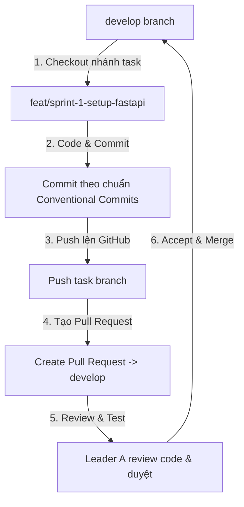

# 📌 QUY ƯỚC LÀM VIỆC VỚI GIT (GIT WORKFLOW & COMMIT CONVENTION)

## 1. Quy tắc Quản lý Nhánh (Branch Naming Convention)

**Các nhánh cố định (Protected Branches):**
* **`main`** : Nhánh chứa nguồn code hoàn chỉnh nhất, chỉ gộp code khi đã sẵn sàng nộp bài / bảo vệ.
* **`develop`**: Nhánh tích hợp code chính của cả 2 thành viên trong quá trình phát triển.

**Cấu trúc đặt tên nhánh cho mỗi Task trong tuần:**
Mỗi task trong tuần bắt buộc phải tạo 1 nhánh mới từ `develop` theo cấu trúc:
```text
{prefix}/{sprint}-{task-name}
```

**Prefixes chuẩn quốc tế:**
* `feat/`: Tính năng mới (Feature)
* `research/`: Nghiên cứu lý thuyết / thu thập data
* `chore/`: Cấu hình file, thư viện, Dockerfile, setup môi trường
* `docs/`: Viết báo cáo, vẽ sơ đồ, slide
* `fix/`: Sửa lỗi bug

**📂 Danh sách Tên Nhánh chuẩn cho 13 Tasks của nhóm:**

**Sprint 1:**
* `feat/sprint-1-setup-fastapi` (Thành viên A)
* `research/sprint-1-research-yolov8` (Thành viên A)
* `chore/sprint-1-pytorch-config` (Thành viên B)
* `research/sprint-1-opencv-laplacian` (Thành viên B)
* `research/sprint-1-collect-dataset` (Thành viên B)

**Sprint 2:**
* `feat/sprint-2-yolov8-detection` (Thành viên A)
* `feat/sprint-2-json-response-wrapper` (Thành viên A)
* `feat/sprint-2-opencv-blur-detection` (Thành viên B)
* `test/sprint-2-threshold-calibration` (Thành viên B)

**Sprint 3:**
* `chore/sprint-3-ai-dockerfile` (Thành viên A)
* `test/sprint-3-docker-integration` (Thành viên A)
* `docs/sprint-3-confusion-matrix-report` (Thành viên B)
* `docs/sprint-3-presentation-slides` (Thành viên B)

---

## 2. 💬 Quy ước Commit Message (Conventional Commits 1.0.0)

**Cú pháp Commit theo chuẩn quốc tế:**
```text
<type>(<scope>): <mô tả ngắn gọn bằng tiếng Anh/Việt>
```

**Các loại `<type>`:**
* **`feat`**: Thêm một chức năng mới.
* **`fix`**: Sửa một lỗi (bug).
* **`docs`**: Cập nhật tài liệu, file markdown, báo cáo.
* **`chore`**: Thay đổi file cấu hình, `requirements.txt`, Dockerfile.
* **`test`**: Thêm hoặc chạy các bài test, cân chỉnh threshold.
* **`refactor`**: Tối ưu hóa code nhưng không làm thay đổi tính năng.

**Ví dụ Commit đúng chuẩn:**
* `feat(ai-core): implement YOLOv8 object detection in yolo_service.py`
* `feat(backend): create /api/v1/analyze endpoint`
* `chore(devops): configure requirements.txt with CPU-only PyTorch`
* `test(cv): determine optimal blur threshold with 50 test images`
* `docs(report): write YOLOv8 theory and confusion matrix`

---

## 3. 🔄 Quy trình làm việc và Review Code (PR / Merge Workflow)



**Các bước thực hiện cụ thể:**

**Bước 1: Lấy code mới nhất trước khi làm task**
```bash
git checkout develop
git pull origin develop
```

**Bước 2: Tạo nhánh mới cho task tương ứng**
```bash
git checkout -b feat/sprint-1-setup-fastapi
```

**Bước 3: Thực hiện công việc và Commit code**
```bash
git add .
git commit -m "feat(backend): setup FastAPI directory structure and main.py"
```

**Bước 4: Push nhánh lên GitHub**
```bash
git push origin feat/sprint-1-setup-fastapi
```

**Bước 5: Tạo Pull Request (PR) & Review (Nghiêm cấm Push thẳng vào develop/main)**
1. **Thành viên B** lên GitHub/GitLab bấm **Create Pull Request** từ nhánh `feat/...` vào nhánh `develop`.
2. **Thành viên A** vào kiểm tra code (Code Review), kiểm tra đúng chuẩn commit và chạy thử.
3. Nếu OK -> **Thành viên A** bấm **Approve & Merge** vào `develop`.
4. Sau khi Merge xong, xóa nhánh feature đó trên GitHub để giữ repo sạch sẽ.