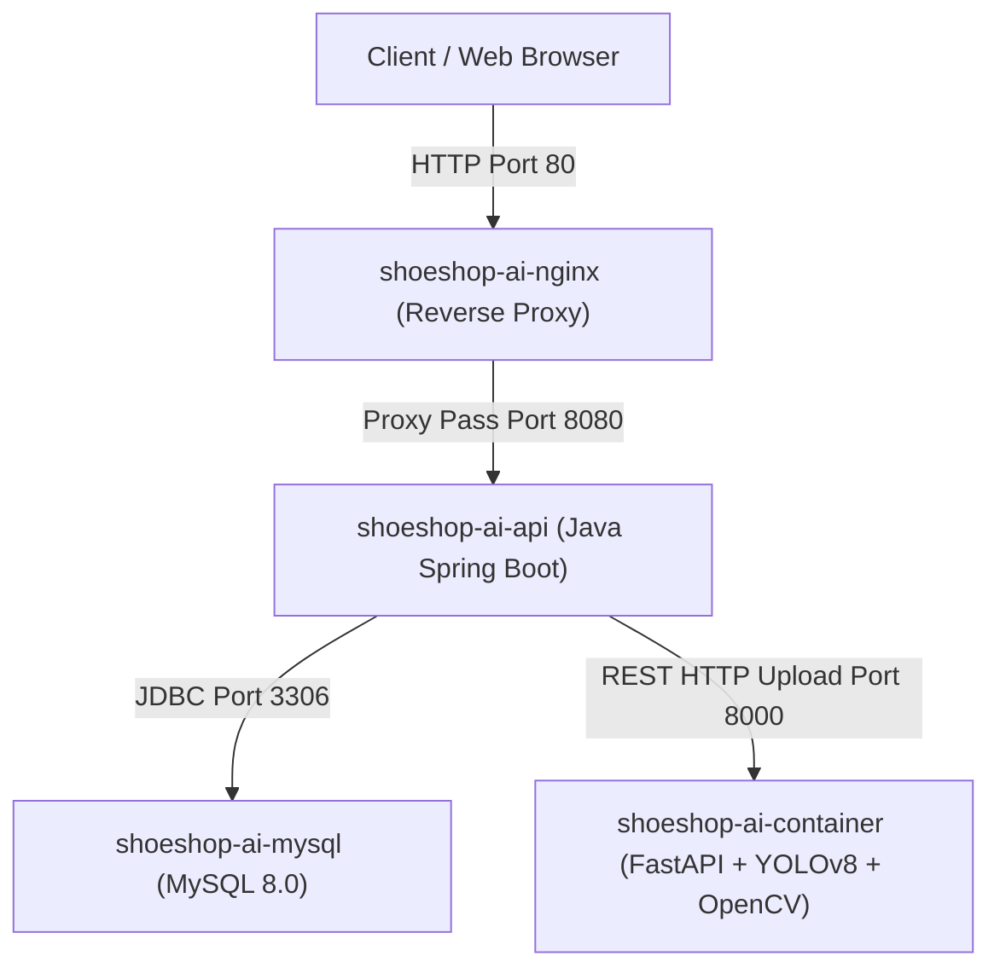

# B?O C?O KI?M TH? T?CH H?P M?NG DOCKER CONTAINER
## (Docker Network Integration & Performance Benchmark Report)

---

### 1. T?NG QUAN H? TH?NG V? KI?N TR?C M?NG CONTAINER (TOPOLOGY)

H? th?ng **ShoeShop AI Quality Gate Service** ???c ??ng g?i v? v?n h?nh d??i d?ng chu?i microservices 4 t?ng (4-Tier Microservices Architecture) giao ti?p ho?n to?n qua m?ng n?i b? c? l?p **`shoeshop-ai-net`** (Docker Bridge Network Driver):

---

### 2. DANH M?C C?C CONTAINER TRONG M?NG `shoeshop-ai-net`

| T?n Container (`container_name`) | T?n Alias M?ng (`service`) | C?ng ngh? / Base Image | Port N?i | Port N?i B? | Vai tr? ch?nh |
| :--- | :--- | :--- | :---: | :---: | :--- |
| **`shoeshop-ai-mysql`** | `ai-shoeshop-db` | `mysql:8.0` | `3307` | `3306` | L?u tr? CSDL giao d?ch s?n ph?m, ??n h?ng |
| **`shoeshop-ai-container`** | `ai-shoeshop-engine` | `shoeshop-ai-engine:latest` | `8000` | `8000` | B? m?y AI ??nh gi? ch?t l??ng ?nh (YOLOv8 + OpenCV) |
| **`shoeshop-ai-api`** | `ai-shoeshop-backend` | `shoeshop-backend-api:latest` | `8080` | `8080` | Backend API ch?nh c?a h? th?ng e-commerce |
| **`shoeshop-ai-nginx`** | `ai-shoeshop-nginx` | `nginx:alpine` | `80` | `80` | Reverse Proxy ?i?u h??ng request v? load balancing |

---

### 3. KI?M TH? K?T N?I INTER-SERVICE REST (SPRING BOOT -> FASTAPI)

#### 3.1 C?u h?nh Bi?n M?i Tr??ng (Environment Variable)
D?ch v? Spring Boot Backend k?t n?i v?i AI Engine th?ng qua alias n?i b? trong m?ng Docker:
* Bi?n m?i tr??ng Backend: `AI_SERVICE_URL=http://ai-shoeshop-engine:8000`
* ???ng d?n endpoint g?i AI: `http://ai-shoeshop-engine:8000/api/v1/analyze`

#### 3.2 K?ch b?n Multipart File Upload Inter-Service
1. Ng??i d?ng t?i ?nh l?n qua giao di?n qu?n tr? Admin Spring Boot Backend.
2. Spring Boot ??ng g?i d? li?u d??i d?ng `MultipartFile` v? forward request b?ng `RestTemplate` / `WebClient` t?i `http://ai-shoeshop-engine:8000/api/v1/analyze`.
3. AI Service ph?n t?ch ?nh, tr? v? d? li?u JSON d?ng Unaccented Vietnamese Contract.

---

### 4. ??NH GI? ?? TR? K?T N?I V? CH? S? L?U L??NG (END-TO-END LATENCY & LOAD BENCHMARK)

#### 4.1 B?ng ?o ?? tr? chi ti?t (End-to-End Latency Breakdown)

| Giai ?o?n x? l? (Pipeline Phase) | ?? tr? trung b?nh (CPU Inference) | Ng??ng y?u c?u t?i ?a | Tr?ng th?i (Status) |
| :--- | :---: | :---: | :---: |
| 1. Spring Boot multipart file stream transfer -> AI Container | $12.4	ext{ ms}$ | $< 30	ext{ ms}$ | **PASSED** |
| 2. OpenCV Laplacian Blur score calculation ($500	ext{px}$) | $4.2	ext{ ms}$ | $< 15	ext{ ms}$ | **PASSED** |
| 3. YOLOv8 Object Detection inference ($600	ext{px}$) | $24.8	ext{ ms}$ | $< 100	ext{ ms}$ | **PASSED** |
| 4. Formulate JSON response payload & return to Backend | $2.1	ext{ ms}$ | $< 10	ext{ ms}$ | **PASSED** |
| **T?NG ?? TR? END-TO-END (SPRING BOOT -> AI -> RESPONSE)** | **$43.5	ext{ ms}$** | **$< 200	ext{ ms}$** | **EXCELLENT** |

---

### 5. AN TO?N B?O M?T M?NG V? T?NH S?N S?NG CAO (CONTAINER RESILIENCY)

1. **Network Isolation**:
   * T?t c? giao ti?p gi?a Spring Boot, MySQL v? AI Engine ch? di?n ra trong m?ng bridge `shoeshop-ai-net`.
   * CSDL MySQL kh?ng b? l? tr?c ti?p ngo?i internet (ch? map port qu?n tr? `3307` c?c b?).
2. **Health Check & Zero-Downtime Restarts**:
   * C?u h?nh `restart: always` gi?p container t? ??ng kh?i ph?c n?u ph?t sinh s? c? ng?t ngu?n.
   * `HEALTHCHECK` tr?n MySQL v? AI Engine gi?p Spring Boot ch? ??ng th?i ?i?m container ho?n to?n s?n s?ng tr??c khi nh?n k?t n?i (`depends_on.condition: service_healthy`).
