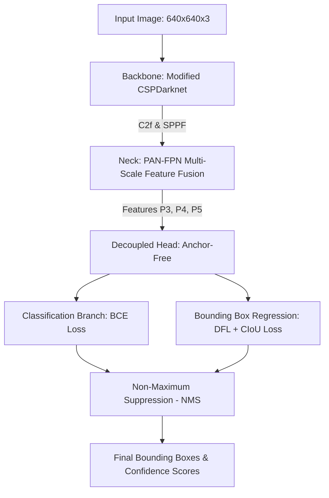

# Báo cáo Nghiên cứu Lý thuyết: Kiến trúc YOLOv8 & Cơ chế Nhận diện Đối tượng
==============================================================================

> **Môn học**: Trí tuệ Nhân tạo (Artificial Intelligence)  
> **Dự án**: AI Quality Gate — Kiểm duyệt chất lượng ảnh sản phẩm E-commerce  
> **Tác giả**: Leader A (Chuyên trách Deep Learning & Core AI)  
> **Sprint**: Sprint 1 — Task 2: Research YOLOv8 Architecture & Object Detection  

---

## 1. Tổng quan về YOLOv8 (You Only Look Once v8)

YOLOv8 là thế hệ mô hình nhận diện đối tượng (Object Detection) hiện đại nhất được phát triển bởi **Ultralytics** (phát hành năm 2023). YOLOv8 thuộc họ mô hình **Single-Stage Object Detector**, cho phép dự đoán cả vị trí (Bounding Box) và nhãn (Class) của đối tượng chỉ qua **một lượt lan truyền tiến (single forward pass)** qua mạng nơ-ron.

### Các ưu điểm vượt trội của YOLOv8 trong bài toán E-commerce:
* **Tốc độ xử lý (Real-time Latency)**: Mô hình `yolov8n.pt` (nano) có thời gian suy luận (Inference time) chỉ từ **10ms - 25ms** trên CPU, vô cùng phù hợp cho dịch vụ REST API backend.
* **Độ chính xác cao (mAP)**: Đạt mAP50-95 vượt trội so với YOLOv5, YOLOv7 cùng quy mô tham số.
* **Kiến trúc Anchor-Free**: Giúp nhận diện linh hoạt các sản phẩm có hình dạng, tỉ lệ bất kỳ mà không bị gò bó bởi các khung mẫu Anchor Box cố định.

---

## 2. Kiến trúc Mạng Nơ-ron YOLOv8 (Neural Network Architecture)

Kiến trúc YOLOv8 bao gồm 3 thành phần chính: **Backbone**, **Neck**, và **Head**.



### 2.1. Backbone (Mạng trích xuất đặc trưng)
* **Modified CSPDarknet**: Sử dụng các khối **C2f (Cross Stage Partial with 2 Convolutions)** thay thế cho khối C3 ở YOLOv5. Khối C2f kết hợp kết nối tắt (Shortcut Connection) và tách luồng gradient, giúp mô hình học các đặc trưng phong phú hơn mà vẫn giữ mạng nhẹ.
* **SPPF (Spatial Pyramid Pooling - Fast)**: Đặt ở cuối Backbone để tổng hợp đặc trưng ở nhiều tỉ lệ vùng nhìn (Receptive Field) khác nhau mà không làm tăng chi phí tính toán.

### 2.2. Neck (Mạng hợp nhất đặc trưng)
* Sử dụng cấu trúc **PAN-FPN (Path Aggregation Network + Feature Pyramid Network)** truyền dữ liệu đa tỷ lệ theo 2 chiều (Top-down và Bottom-up).
* Trích xuất 3 mức bản đồ đặc trưng (Feature Maps):
  * **P3/8** (Độ phân giải cao): Dùng để phát hiện các vật thể nhỏ (Small objects).
  * **P4/16** (Độ phân giải trung bình): Dùng để phát hiện vật thể kích thước vừa.
  * **P5/32** (Độ phân giải thấp): Dùng để phát hiện các vật thể lớn bao phủ phần lớn bức ảnh.

### 2.3. Head (Đầu ra dự đoán - Decoupled Head)
* **Decoupled Head**: YOLOv8 tách riêng nhánh dự đoán **Phân loại nhãn (Classification)** và nhánh dự đoán **Tọa độ khung (Bounding Box Regression)**.
* **Anchor-Free Mechanism**: Không sử dụng Anchor Boxes như YOLOv3/v5. Thay vào đó, mạng dự đoán trực tiếp khoảng cách từ điểm tâm của Cell đến 4 cạnh của Bounding Box $(top, bottom, left, right)$.
* **Hàm mất mát (Loss Functions)**:
  * Loss phân loại: **BCE (Binary Cross-Entropy) Loss**.
  * Loss bounding box: **CIoU (Complete IoU) Loss** + **DFL (Distribution Focal Loss)** giúp việc khôi phục tọa độ chính xác từng pixel.

---

## 3. Cơ chế Trích xuất Bounding Box (Bounding Box Extraction Mechanism)

Tọa độ Bounding Box trả về từ mô hình YOLOv8 được biểu diễn dưới dạng ma trận Tensor $N \times 6$:
$$\text{Box}_i = [x_{min}, y_{min}, x_{max}, y_{max}, \text{confidence}, \text{class\_id}]$$

```
(x_min, y_min) ┌────────────────────────┐
               │                        │
               │    Product Item        │
               │   (Shoe / Sandal)      │
               │                        │
               └────────────────────────┘ (x_max, y_max)
```

### Quy trình 3 bước trích xuất & lọc Bounding Box:

1. **Lọc Ngưỡng Tin Cậy (Confidence Threshold Filtering)**:
   Lọc bỏ tất cả các Bounding Box có điểm tin cậy nhỏ hơn ngưỡng $\tau_{conf}$:
   $$\text{Keep Box if } \text{confidence} \ge \tau_{conf} \quad (\text{Ví dụ: } \tau_{conf} = 0.25)$$

2. **Thuật toán Triệt tiêu Không-Cực-Đại (Non-Maximum Suppression - NMS)**:
   Nếu có nhiều Bounding Box đè lên cùng một sản phẩm, NMS sẽ tính chỉ số trùng lặp IoU (Intersection over Union):
   $$\text{IoU}(A, B) = \frac{\text{Area}(A \cap B)}{\text{Area}(A \cup B)}$$
   Giữ lại Bounding Box có điểm tin cậy cao nhất và xóa các Bounding Box có $\text{IoU} > \tau_{NMS}$ (thường chọn $\tau_{NMS} = 0.45$).

3. **Chuẩn hóa Tọa độ về Kích thước Ảnh**:
   Chuyển đổi tọa độ từ tuyệt đối $(x_{min}, y_{min}, x_{max}, y_{max})$ sang tỉ lệ tương đối $[0.0, 1.0]$ để phục vụ tính toán diện tích.

---

## 4. Công thức Toán học Tính Tỉ lệ Bao phủ Sản phẩm (`max_object_ratio`)

Trong bài toán kiểm duyệt ảnh sản phẩm E-commerce, tiêu chí hàng đầu là **Sản phẩm chính phải chiếm tỉ lệ diện tích đủ lớn trong bức ảnh** (không được chụp quá xa hoặc quá nhỏ).

### 4.1. Công thức tính diện tích Bounding Box và Ảnh:
Giả sử ảnh có chiều rộng $W$ và chiều cao $H$, diện tích toàn bộ bức ảnh là:
$$\text{Area}_{image} = W \times H$$

Với một Bounding Box $i$ có tọa độ $(x_{min, i}, y_{min, i}, x_{max, i}, y_{max, i})$, diện tích của Bounding Box là:
$$\text{Area}_{box, i} = (x_{max, i} - x_{min, i}) \times (y_{max, i} - y_{min, i})$$

### 4.2. Công thức tính Tỉ lệ Bao phủ (Coverage Ratio):
Tỉ lệ diện tích đối tượng $i$ so với tổng diện tích ảnh:
$$\text{Ratio}_{object, i} = \frac{\text{Area}_{box, i}}{\text{Area}_{image}}$$

### 4.3. Công thức Tỉ lệ Bao phủ Tối đa (`max_object_ratio`):
$$\text{max\_object\_ratio} = \max_{i \in \mathcal{S}_{valid}} \left( \text{Ratio}_{object, i} \right)$$
Trong đó $\mathcal{S}_{valid}$ là tập hợp các Bounding Box thuộc danh mục sản phẩm hợp lệ (Ví dụ: `shoes`, `footwear`, `backpack`, `bag`...).

### 4.4. Quy tắc Đánh giá Tiêu chuẩn E-commerce (Quality Gate Rule):
$$\text{Object Status} = \begin{cases} 
\text{APPROVED} & \text{nếu } \text{MIN\_OBJECT\_RATIO} \le \text{max\_object\_ratio} \le \text{MAX\_OBJECT\_RATIO} \\ 
\text{REJECTED (Too Small)} & \text{nếu } \text{max\_object\_ratio} < \text{MIN\_OBJECT\_RATIO} \quad (\text{Mặc định: } 0.08) \\
\text{REJECTED (Too Large/Overflown)} & \text{nếu } \text{max\_object\_ratio} > \text{MAX\_OBJECT\_RATIO} \quad (\text{Mặc định: } 0.85)
\end{cases}$$

---

## 5. Thiết kế Kiến trúc Code cho Sprint 2 (Python Ultralytics Blueprint)

Dưới đây là mẫu hàm Python chuẩn hóa để triển khai ở **Task 6 (Sprint 2)**:

```python
import cv2
import numpy as np
from ultralytics import YOLO

# Khởi tạo mô hình
model = YOLO('yolov8n.pt')

def extract_yolo_metrics(image_bgr: np.ndarray, conf_threshold: float = 0.25):
    """
    Trích xuất Bounding Box và tính toán max_object_ratio từ YOLOv8.
    """
    img_h, img_w = image_bgr.shape[:2]
    img_area = float(img_h * img_w)
    
    # Chạy YOLOv8 inference
    results = model(image_bgr, conf=conf_threshold, verbose=False)
    
    max_object_ratio = 0.0
    detected_objects = []
    
    for result in results:
        boxes = result.boxes
        if boxes is None or len(boxes) == 0:
            continue
            
        for box in boxes:
            # Lấy tọa độ bounding box [x1, y1, x2, y2]
            x1, y1, x2, y2 = box.xyxy[0].tolist()
            box_area = (x2 - x1) * (y2 - y1)
            ratio = box_area / img_area
            
            cls_id = int(box.cls[0])
            cls_name = model.names.get(cls_id, f'class_{cls_id}')
            confidence = float(box.conf[0])
            
            detected_objects.append({
                'class_name': cls_name,
                'confidence': round(confidence, 4),
                'ratio': round(ratio, 4),
                'bbox': [round(x1, 1), round(y1, 1), round(x2, 1), round(y2, 1)]
            })
            
            if ratio > max_object_ratio:
                max_object_ratio = ratio

    return {
        'max_object_ratio': round(max_object_ratio, 4),
        'num_objects': len(detected_objects),
        'objects': detected_objects
    }
```

---

## 6. Kết luận

Nghiên cứu này cung cấp đầy đủ nền tảng lý thuyết toán học và kiến trúc nơ-ron của **YOLOv8**, phục vụ cho việc:
1. Viết code thuật toán nhận diện tại **Task 6 (Sprint 2)**.
2. Viết chương **Báo cáo Lý thuyết AI & Confusion Matrix** tại **Task 12 (Sprint 3)** để bảo vệ trước hội đồng chấm thi.
